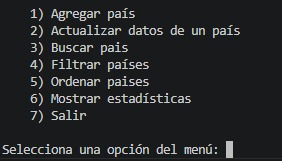
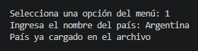
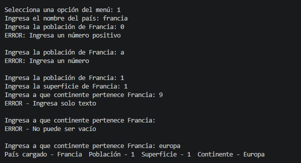
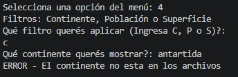
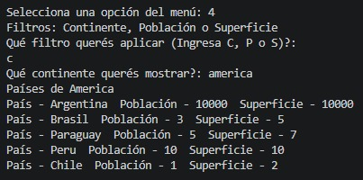
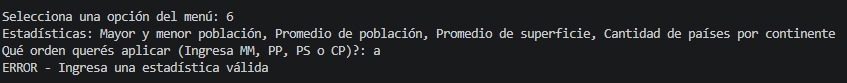
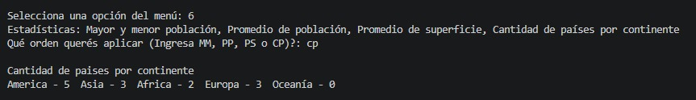

# TPI_TUP_DiLorenzo_Gestión_de_Datos_de_Países_PY 
# Proyecto final de programación I - Gestión de países con csv en Python

## Descripción

El programa se trata de un menú el cual tiene como fuente de datos un archivo csv **paises.csv** y nos presenta distintas opciones para manejar el archivo en base a las características solicitadas para este TPI.

## Instrucciones 

Al ejecutar el programa tenemos un menú el cuál nos presenta 7 opciones diferentes para realizar operaciones (la validación del número está implementada mediante una función con un bloque `try/except`):

1. **Agregar país**
   Se trata de la carga de un nuevo país al archivo csv. El programa le va a solicitar al usuario los 4 parámetros requeridos para la carga:
   * **Nombre del país:** verifica que el país no esté ingresado previamente en el csv, no sea vacío y solo sean letras.
   * **Población:** verifica que sea un número positivo mayor a 0.
   * **Superficie:** misma verificación que en población.
   * **Continente:** verifica que sea una cadena válida, no vacía y solo de letras.

2. **Actualizar datos de un país**
   Se le solicita al usuario que ingrese el nombre de un país (verifica que este exista en el csv) y luego solicita los nuevos valores de los parámetros **poblacion** y **superficie**. Finalmente muestra un mensaje de éxito con los datos actualizados del país.

3. **Buscar país**
   Se le solicita al usuario que ingrese el nombre de un país (verifica que este exista en el csv) y realiza una búsqueda de coincidencia parcial y/o total. Si tuvo éxito muestra los datos del país, sino se informa que el país ingresado no existe.

4. **Filtrar países**
   Se muestran 3 tipos distintos de filtros posibles:
   * **Continente:** el usuario puede ingresar "c" o "C".
   * **Población:** el usuario puede ingresar "p" o "P". Se pide un mínimo y máximo de población para filtrar entre los topes (valida que el mínimo no sea mayor o igual que el máximo).
   * **Superficie:** el usuario puede ingresar "s" o "S" (igual que población).
   
   Según el filtro que elija el usuario, se llama a una subfunción encargada de seleccionar el parámetro elegido e imprimir los resultados.

5. **Organizar países**
   Se muestran 4 tipos de órdenes posibles:
   * **Nombre:** el usuario puede ingresar "n" o "N" (ordena en orden alfabético).
   * **Población:** el usuario puede ingresar "p" o "P" (ordena de menor a mayor).
   * **Superficie ascendente:** el usuario puede ingresar "sa" o "SA" (ordena de menor a mayor).
   * **Superficie descendente:** el usuario puede ingresar "sd" o "SD" (ordena de mayor a menor).
   
   Según el orden elegido se llama a la subfunción encargada del orden.

6. **Mostrar estadísticas**
   Se muestran 4 tipos de estadísticas posibles:
   * **País de mayor y menor población:** el usuario puede ingresar "mm" o "MM". Se busca entre todos los países y luego se imprime el que tenga la menor y el que tenga la mayor población.
   * **Promedio de población:** el usuario puede ingresar "pp" o "PP". Se suman todos los valores de población y se calcula el promedio general.
   * **Promedio de superficie:** el usuario puede ingresar "ps" o "PS" (igual que promedio población).
   * **Cantidad de países por continente:** el usuario puede ingresar "cp" o "CP". Recorre todos los países y agrega al contador de cada continente, finalmente imprime los resultados de cada continente.

7. **Salir**
   Si el usuario completó su ejecución del programa, se muestra un mensaje de agradecimiento por usar el mismo y se termina su ejecución.

## Ejemplos E/S

### Menú general
 

### Validación de "1. Agregar país" para no repetir país

### Función 1 completa

### Validación de filtro "4. Filtrar países" para que sea uno válido

### Función 4 completa

### Validación de estadística "6. Mostrar estadísticas" para que sea una válida

### Función 6 completa

## Participación 

Proyecto realizado en su totalidad por **Karim Di Lorenzo**.
